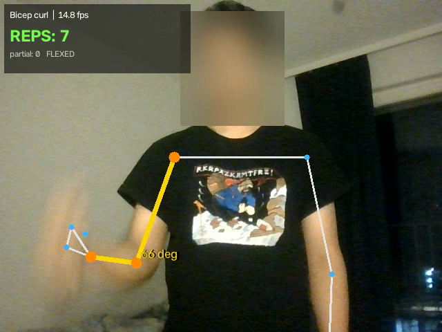
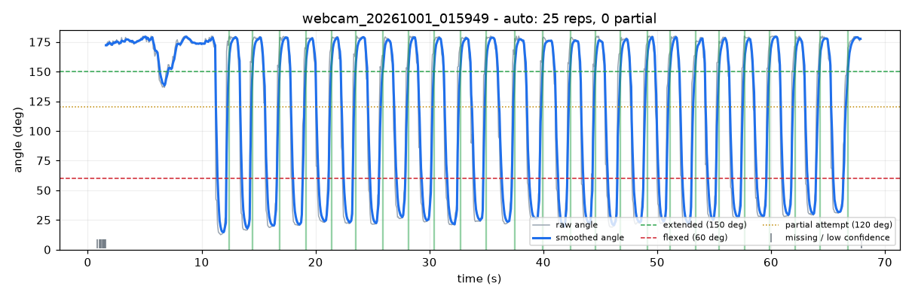

# Exercise Rep Counter

Mini-project for **Applied AI Programming (TX00FM14)**, Metropolia University of Applied Sciences  
Author: **Bibas Dhital**

**Demo video:** https://youtu.be/-fgGx6li6Sw

A Python application that counts exercise repetitions from a **video file, a webcam or a landmark
sequence**. It detects body landmarks with **MediaPipe Pose Landmarker**, calculates a **joint angle**
(elbow for curls and push-ups, knee for squats), smooths it, and counts completed reps with a
**state machine** that also detects **partial reps**. The result is shown live on the video, saved as an
annotated video, a time-series plot, a CSV of the signal and a JSON summary.

> This is a programming and AI exercise. It is **not** medical, physiotherapy or safety advice.

## Features

- Input: **video file**, **webcam** or **landmark sequence (CSV)**
- Three exercises: **bicep curl**, **squat**, **push-up**
- Joint angle from three landmarks (2D image coordinates, or **3D world landmarks** with `--world`)
- **Exponential moving average** smoothing of the angle
- **State machine with two thresholds** (hysteresis) and a **minimum rep duration**
- **Partial / incomplete reps** detected and reported separately (not counted)
- Tracks the **better visible side automatically**, one chosen side, or **left and right separately**
- **Missing landmarks, low confidence and no-person frames** are skipped with an on-screen warning
- **Configurable thresholds** (`--extended`, `--flexed`), smoothing and visibility limit
- Draws the skeleton, the tracked joint and its angle, the count and the state on every frame
- Saves an **annotated video** with the **face blurred**, a **time-series graph**, the signal CSV and a summary
- **Evaluation script** comparing automatic and human counts on 19 tests, with three comparison methods

## Project structure

```
exercise-rep-counter/
├── counter.py            # main program: video / webcam / landmark input, drawing, outputs
├── rep_counter.py        # core logic: angles, smoothing, state machine, file formats, plots
├── evaluate.py           # runs all tests in tests.csv and writes the results
├── make_synthetic.py     # creates synthetic landmark sequences with known rep counts
├── tests.csv             # test list with the human (expected) counts
├── data/synthetic/       # 11 synthetic landmark sequences
├── data/recorded/        # landmark sequences from my own videos and webcam (no images)
├── results/              # evaluation_results.md, plots and per-test outputs
├── videos/               # my raw test videos (NOT uploaded, see Privacy)
├── models/               # MediaPipe model, downloaded automatically (not uploaded)
├── outputs/              # annotated videos and results of single runs (not uploaded)
├── requirements.txt
└── README.md
```

## Setup and running

Requires Python 3.9–3.12. The first run downloads the MediaPipe model (about 9 MB) into `models/`.

```bash
git clone https://github.com/Bibas41/exercise-rep-counter.git
cd exercise-rep-counter
python -m venv .venv
.venv\Scripts\Activate.ps1          # Windows PowerShell
# source .venv/bin/activate         # macOS / Linux
pip install -r requirements.txt
```

| What | Command |
|---|---|
| Count curls in a video, with a live window | `python counter.py --input videos/curl_normal.mp4 --exercise curl --show` |
| Squats from the webcam (press **q** to stop) | `python counter.py --webcam --exercise squat` |
| Count from a landmark sequence (no camera needed) | `python counter.py --landmarks data/synthetic/curl_partial.csv --exercise curl` |
| Count left and right arm separately | `python counter.py --input my_video.mp4 --exercise curl --side both` |
| Use 3D world landmarks (other camera angles) | `python counter.py --input videos/curl_front.mp4 --exercise curl --world` |
| Custom thresholds | `python counter.py --input my_video.mp4 --exercise squat --extended 165 --flexed 90` |
| Sideways phone video | add `--rotate 90` (or 180 / 270) |
| Recreate the synthetic sequences | `python make_synthetic.py` |
| Run all tests | `python evaluate.py` |

Other options: `--model lite|full|heavy`, `--smoothing 0.4` (1 = off), `--min-visibility 0.3`,
`--no-video`, `--no-blur`. Run `python counter.py --help` for the full list.

Each run writes to `outputs/<name>_<exercise>/`:

| File | Content |
|---|---|
| `annotated.mp4` | Video with skeleton, angle, rep count, state, warnings, face blurred |
| `plot.png` | Raw and smoothed angle over time, thresholds, counted reps (green) and partial reps (orange) |
| `signal.csv` | Per frame: time, side, raw angle, smoothed angle, visibility, state, count |
| `summary.json` | Counts, partial and rejected reps, thresholds, missing-frame percentage, start and end of every rep |
| `landmarks.csv` | The landmark sequence (can be counted again with `--landmarks`) |

The terminal also prints the result, for example:

```
Exercise:            Bicep curl - elbow angle (shoulder-elbow-wrist)
Thresholds:          extended >= 150 deg, flexed <= 60 deg
Completed reps (auto): 5
Partial reps:        3 (not counted)
Rejected (too fast): 0
Frames:              516 (17.17 s), 0.0% missing or low confidence
```

Example from the laptop webcam (25 curls, all counted). The face is blurred automatically:





## How it works

```
video frame -> MediaPipe Pose Landmarker -> 33 landmarks -> pick side + 3 landmarks -> joint angle
   -> skip if missing / low visibility -> smoothing (EMA) -> state machine -> count, partial reps
   -> draw on frame, save video, CSV, plot, summary
```

### Pose estimation model

[MediaPipe Pose Landmarker](https://ai.google.dev/edge/mediapipe/solutions/vision/pose_landmarker)
(`pose_landmarker_full`, float16) through the MediaPipe Tasks Python API, in **VIDEO** running mode,
which uses tracking between frames. It returns 33 landmarks per person with x, y (normalised image
coordinates), z (relative depth) and a **visibility** score, plus **world landmarks** in metres with the
hips as the origin. It runs **locally on the CPU**; no video is sent to any service. Only one person is
tracked (`num_poses=1`).

Landmarks are converted to **pixel coordinates** before the angle is calculated, so the angle is not
distorted by the video's aspect ratio.

### Exercises, landmarks and joint angles

| Exercise | Landmarks (first, **joint**, third) | Signal |
|---|---|---|
| Bicep curl | shoulder, **elbow**, wrist | elbow angle |
| Squat | hip, **knee**, ankle | knee angle |
| Push-up | shoulder, **elbow**, wrist | elbow angle |

The angle at the middle joint is calculated from two vectors, joint→first and joint→third, with the
dot product and arccosine (NumPy `arccos`), giving 0–180°:

angle = arccos( (BA · BC) / (‖BA‖ ‖BC‖) )

A joint angle was chosen instead of raw pixel positions because it does not depend on where the person
stands, how far they are from the camera or how tall they are.

**Side selection:** in `auto` mode the side whose three landmarks have the highest visibility is used.
The tracker only switches sides when the other side is clearly better (by 0.15), so it does not jump back
and forth. `--side left/right` fixes the side, and `--side both` counts both sides separately.

### Movement phases and state machine

Each rep has three phases: start position (joint **extended**), working phase (joint bends), bottom of
the rep (joint **flexed**), and back to the start.

```
            angle >= extended            angle <= flexed
 WAITING ----------------------> EXTENDED ----------------> FLEXED
                                    ^                          |
                                    |   angle >= extended      |
                                    +--------------------------+
                                       +1 rep (if >= min duration)
```

- **WAITING:** at the start, nothing is counted until the person is in the start position.
- **EXTENDED:** waiting for the joint to bend past the *flexed* threshold.
- **FLEXED:** the bottom was reached; waiting for the return to the *extended* threshold.

**One completed repetition = extended → flexed → extended**, lasting at least the minimum duration.

**Partial rep:** if the angle goes below the *attempt* threshold but returns to *extended* without
reaching *flexed*, it is recorded as a partial (incomplete) rep and **not counted**. It is shown on
screen and in the plot (orange line).

### Thresholds and rules

| Exercise | Extended | Flexed | Partial attempt | Min. rep duration |
|---|---|---|---|---|
| Bicep curl | ≥ 150° | ≤ 60° | < 120° | 0.5 s |
| Squat | ≥ 160° | ≤ 100° | < 140° | 0.6 s |
| Push-up | ≥ 150° | ≤ 90° | < 130° | 0.5 s |

Why these values:
- **Extended:** a straight arm or leg measures about 160–180° in the image. The threshold is lower so
  that reps count even when the person does not lock out completely and the landmarks are a little noisy.
- **Flexed:** the top of a full curl is usually 30–50°, so ≤ 60° requires a nearly full curl. For squats,
  ≤ 100° is close to thighs parallel to the floor. For push-ups, 90° is the common elbow standard.
- **Two thresholds (hysteresis):** the angle must cross *both* thresholds for a rep, so noise around one
  value can never add a rep. This was the biggest improvement over a single threshold (see results).
- **Minimum duration 0.5–0.6 s:** a real full rep cannot be faster. Faster "reps" come from tracking
  glitches (for example the wrist jumping onto another point for a few frames) and are rejected.
- **Visibility ≥ 0.3:** frames where any of the three landmarks is less visible are skipped. I started
  with 0.5, but in a webcam test 67% of the frames were skipped; with 0.3, only 1% were skipped and all
  25 curls of the next webcam test were counted. MediaPipe often gives the arm facing the camera
  a visibility between 0.3 and 0.5 even when it is clearly visible.
- **Smoothing:** exponential moving average with α = 0.4 (at 30 fps this adds only about 2 frames of
  delay). A smoothing factor that is too low would lag behind fast reps. At the end of a video, a last
  rep that the smoothed value had not caught up with yet is still completed.
- **Gaps:** if no valid angle is seen for more than 1 s, the smoothing is restarted so old and new values
  are not mixed. The state is kept, so counting continues after the person is visible again.

All thresholds and the smoothing can be changed from the command line.

### Missing landmarks and errors

| Situation | Behaviour |
|---|---|
| No person in the frame | Frame skipped, "No person detected" shown, counting continues afterwards |
| Tracked joints hidden / low visibility | Frame skipped, "Joints not visible - frame skipped" shown |
| Long gap (> 1 s) | Smoothing restarted, state kept |
| Tracking glitch (impossibly fast rep) | Rep rejected, reported as "rejected" |
| Video file missing / cannot be opened / no frames | Clear error message, no crash |
| Webcam not available | Clear error message |
| Model cannot be downloaded | Error with the download link to save the model manually |
| Invalid landmark CSV or thresholds | Clear error message |

## Testing and results

The counter was tested with **19 tests**: **11 synthetic landmark sequences** with known counts (created
by `make_synthetic.py`), **7 videos of myself recorded with a phone** and **1 webcam recording**, all
counted by hand. The synthetic data tests the logic under controlled conditions: normal speed, fast,
slow with pauses, partial reps, strong landmark noise, dropped frames with a long gap, tracking
glitches, shallow squats, push-ups and no person. The real recordings test normal and fast curls,
partial curls, a front camera angle, the arm leaving the frame twice, normal squats, and deep and
shallow squats mixed.

| Real recording | What I did | Human count |
|---|---|---|
| curl_normal | 10 curls, side view | 10 |
| curl_fast | 10 fast curls, side view | 10 |
| curl_partial | 5 full and 3 half curls mixed | 5 (+3 partial) |
| curl_front | 8 curls facing the camera | 8 |
| curl_occluded | 8 curls, stepped out of the picture twice | 8 |
| squat_normal | 8 squats, side view, whole body | 8 |
| squat_shallow | 4 deep and 4 shallow squats mixed | 4 (+4 partial) |
| webcam_curl | 25 curls in front of the laptop webcam | 25 |

Every test is also run with three other methods to show the effect of the design choices:
1. **Final counter:** 2D image angle, state machine with two thresholds, smoothing and minimum duration
2. **Without smoothing:** the same, with smoothing turned off
3. **3D world landmarks:** the same counter, but the angle comes from MediaPipe's 3D world landmarks
   (real videos only, because it needs the video itself)
4. **Naive baseline:** +1 every time the raw angle drops below one threshold (midpoint)

<!-- EVAL_START -->
_Generated by `python evaluate.py` on 2026-10-01: 19 tests run._

**Overall** (automatic count compared with the human count)

| Method | Exact count | Mean abs. error | Extra reps (false positives) | Missed reps (false negatives) |
|---|---|---|---|---|
| State machine + smoothing (final) | 18/19 | 0.05 | 0 | 1 |
| State machine without smoothing | 17/19 | 0.11 | 1 | 1 |
| State machine with 3D world landmarks (real videos only) | 2/7 | 5.00 | 0 | 35 |
| Naive single threshold (baseline) | 8/19 | 2.00 | 38 | 0 |

**Per category** (final counter)

| Category | Tests | Exact count | Mean abs. error |
|---|---|---|---|
| Synthetic | 11 | 10/11 | 0.09 |
| Real video | 5 | 5/5 | 0.00 |
| Real video - difficult angle | 1 | 1/1 | 0.00 |
| Real video - difficult | 1 | 1/1 | 0.00 |
| Real webcam | 1 | 1/1 | 0.00 |

All tests with plots: [results/evaluation_results.md](results/evaluation_results.md)
<!-- EVAL_END -->

### Summary of the results

- **The final counter got 18 of 19 tests exactly right**, including **all 8 real recordings**, with
  **no extra reps at all**. The only miss is the synthetic test where the bottom of a rep is hidden on
  purpose (explained below).
- **The two-threshold state machine is the biggest improvement:** the naive single threshold added
  **38 extra reps** (partial reps, noise and glitches) and was right in only 8 of 19 tests.
- **Smoothing removed one extra rep** in the real videos (17/19 without smoothing, 18/19 with it).
- **3D world landmarks were much worse than the 2D angle** (2 of 7 videos right, 35 reps missed).
  MediaPipe estimates the 3D positions from a single camera image; for the arm, the estimated depth
  changes the elbow angle so much that it rarely went below 60° or above 150°, so most reps only reached
  the "partial" state. The thresholds were chosen for 2D angles; 3D angles would need their own
  thresholds, and the 2D angle was clearly more reliable for my videos.
- **Partial reps are less reliable than completed reps.** In the real videos, the counter found a few
  more partial reps than I did (for example 7 instead of 4 in squat_shallow). They came from walking to
  and from the camera at the start and end, picking up the bottle and lowering the arm, which bend the
  knee or elbow a little. Partial reps are never counted as reps, so this did not affect the rep count.
- **The depth of a "shallow" squat matters.** In my first squat_shallow recording, two of my "shallow"
  squats were deeper than I intended and went below 100°, so they were counted (6 instead of 4). I
  recorded the video again with clearly shallower squats, and it counted exactly 4. This shows that a
  rep that is almost deep enough is a borderline case for any fixed threshold.

## Discussion

### False positives (extra reps)

- The **naive single threshold** counts every dip below the threshold: partial reps, noise crossing the
  threshold twice and tracking glitches all become extra reps. The two-threshold state machine removes
  these, because a rep needs a full extended → flexed → extended cycle.
- **Tracking glitches**, where a landmark jumps for a few frames, can look like a full rep. The minimum
  rep duration rejects them.
- **Borderline depth:** a shallow squat or half curl that goes just past the *flexed* threshold is
  counted as a full rep (see the first squat_shallow recording).
- With the default thresholds, a rep that goes almost but not quite to *flexed* is not counted, which
  prevents counting "half reps" as full reps.

### False negatives (missed reps)

- **Hidden bottom of the rep:** if the landmarks are missing exactly while the joint is at its most bent,
  the counter never sees the *flexed* state and cannot count the rep (the synthetic test with a 1.2 s gap
  shows this: 7 of 8). The counter reports it as a partial rep instead of guessing. In my real
  curl_occluded video, I left the picture between reps, so all 8 were counted.
- **Front camera angle:** when a curl is filmed exactly from the front, the forearm moves towards the
  camera, so the 2D elbow angle hardly changes. In my curl_front video all 8 curls were still counted,
  because the arm was slightly turned and the forearm also moved upwards in the image. A perfectly
  frontal view would probably fail. The 3D world landmarks (`--world`) were meant to help here, but they
  were less reliable than the 2D angle in all my videos (see the results).
- **Incomplete range of motion:** people who do not fully straighten or bend never cross the thresholds.
  The thresholds can be adjusted with `--extended` and `--flexed`.
- **Very fast reps:** too much smoothing lags behind fast movement. α = 0.4 was chosen as a compromise.

### What kinds of videos work well

- The **side of the body facing the camera** (side view), so the joint bends in the image plane
- The **whole relevant body part in the frame** (full body for squats, upper body for curls)
- **One person**, good light, plain background, tight but not baggy clothes
- Steady camera at about joint height, normal speed with full range of motion
- Standing still for a moment before and after the set (walking creates small partial "reps")

### What kinds of videos are difficult

- **Front view** for curls and squats (movement towards the camera)
- Body parts **leaving the frame** or hidden behind the body, equipment or loose clothing
- **Several people** in the frame (the model may switch to another person)
- Poor light, motion blur, very fast reps, very small person in the image
- **Partial or inconsistent range of motion** (people with limited mobility may never reach the thresholds)

### Limitations

- Counts only three exercises and one repetition pattern (extended → flexed → extended).
- Thresholds are fixed per exercise; a person's individual range of motion is not learned.
- Form is only checked through the range of motion (partial reps), not through posture, speed or
  symmetry, so it is **not a form coach**.
- Only one person is tracked.

## Privacy, safety and responsible use

- **Only appropriate videos:** all test videos are **my own recordings** of myself, and I agree to
  publish the face-blurred screenshot and plots. The synthetic sequences contain no personal data.
- **Raw videos are not published:** exercise videos show the face, body shape, home and physical ability.
  The `videos/` folder is excluded from Git. Instead, only the **landmark sequences** (`data/recorded/`),
  which contain joint coordinates but no images, and the plots are published, so the results can be
  reproduced with `--landmarks` without sharing the videos.
- **Face blurring:** annotated output videos blur the face by default (`--no-blur` turns it off).
- **Local processing:** the model runs on the computer; no video or landmarks are sent to a cloud service.
- **Not medical advice:** the counter is not validated for medical, physiotherapy or injury-prevention use.
  Users could **overtrust** the count or the "partial" label; a wrong threshold could encourage an
  unsafe range of motion. Anyone with pain or an injury should follow professional advice.
- **Fairness:** thresholds based on a "standard" range of motion may not fit people with disabilities or
  limited mobility, whose reps would be counted as partial. Thresholds should be adjustable (they are).
- **Consent:** filming other people requires their permission, especially in gyms.

## AI assistance

As encouraged in the course, AI assistance (Claude) was used for the code, the synthetic test data and
drafting this README. Recording the test videos, counting the reps by hand, checking the results and the
final decisions were done by the author.

## References

- MediaPipe Pose Landmarker overview: https://developers.google.com/edge/mediapipe/solutions/vision/pose_landmarker
- MediaPipe Pose Landmarker Python guide: https://developers.google.com/edge/mediapipe/solutions/vision/pose_landmarker/python
- Bazarevsky, V. et al. (2020). *BlazePose: On-device Real-time Body Pose tracking.* https://arxiv.org/abs/2006.10204
- OpenCV VideoCapture: https://docs.opencv.org/4.x/d8/dfe/classcv_1_1VideoCapture.html
- OpenCV drawing functions: https://docs.opencv.org/4.x/d6/d6e/group__imgproc__draw.html
- NumPy arccos: https://numpy.org/doc/stable/reference/generated/numpy.arccos.html
- Matplotlib: https://matplotlib.org/
